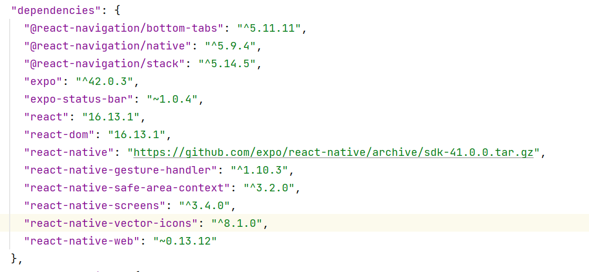
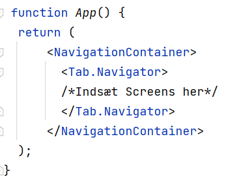

<h1> Øvelsesvejledning til øvelse 2 - Navigation </h1>

<h2> Part One - Tab Navigator</h2>
1. Start med at oprette et nyt projekt. 
2. Installér følgende dependencies;
<ul>
    <li> @react-navigation/bottom-tabs</li>
    <li>@react-navigation/native</li>
    <li>@react-navigation/stack</li>
    <li>react-native-gesture-handler</li>
    <li>react-native-safe-area-context</li>
    <li>react-native-screens</li>
    <li>react-native-vector-icons</li>
            <ul><li>Et skærmklip af package.json filen til den endelige løsning er vedlagt i bilag A.
                Din package.json bør være ens med denne efter installeringen. </li>
            <li>KOPIER linjen herunder til installering;</li>
                </ul>
    </ul>

    
             npm install --save @react-navigation/bottom-tabs @react-navigation/bottom-tabs @react-navigation/native @react-navigation/stack react-native-gesture-handler react-native-safe-area-context react-native-screens react-native-vector-icons

3. Opret en mappe og døb denne 'components'
4. I mappen oprettes tre filer, der kaldes;  'HomeScreen', 'SettingsScreen' & 'DetailsScreen'
    - Opret i hver mappe en tekstkomponent med selvvalgt indhold
5. Gå nu ind i app.json filen og importer de nyopretterede filer. 
6. Inden vi opretter en tabnavigator, skal vi omskrive App.js fra at være en klassekomponent til at være en funktionel komponent.  
7. Nu er vi klar til at konstruere en bottomTabnavigator. 
   - Opret først en const, der kaldes 'Tab' og sæt denne ligmed 'createBottomTabNavigator()'
        - HUSK: createBottomTabNavigator() bør automatisk blive importeret. Er dette ikke tilfældet skal metoden importeres fra @react-navigation/bottom-tab
    - I App komponenten operettes der i det eksisterende return-statement en NavigationContainer, hvori en Navigator komponent oprettes. En Navigator komponent oprettes ved at kalde Navigator på Tab variablen - Tab.Navigator
        - Sidder du fast, er strukturen vedlagt i bilag B.
        - Derudover er der god hjælp i Expo's dokumentation, der kan findes på følgende link:<dd>
          https://reactnavigation.org/docs/tab-based-navigation/</dd>
    - Endeligt færdiggøres Tabnavigatoren ved at oprette tre Tab.Screen komponenter i den netop oprettede Tab.Navigator. 
        - Hver enkelt Tab.Screen komponent har to properties; 'name' & 'component'. 
            - name: angiver en reference på den komponent, der kobles på den enkelte screen. Selve navgivning er vilkår og bestemmes af dig som udvikler 
            - component: Her placeres de importerede for til den enkelte screens komponent.
                - HINT: Igen, hvis du går i stå, så ta' et kig på dokumentationen, der kan findes på det førnævnte link.
    <h3>Tjek af fremskridt</h3>
    <ul>
    <li>Afprøv nu din app. Efter opstart af app'en, bør du nu have en tab navigator med tre tabs.</li>
    <li> Forsøg at navigere mellem de forskeligge screen ved at bruge Tab navigatoren.</li>
    <li>Hvis det fungerer, er du klar til at operette en Stack navigatoren</li>
    </ul>

<h2>Part two - Stack Navigator </h2>  
<ol>
    <li>Opret i components en ny fil, der kaldes 'StackNavigator'. Derudover skal der i components mappen oprettes en ny mappe, der kaldes 'StackComponents'. I denne mappe, skal der oprettes to nye filer med vilkårligt navn. </li>
<li>Gå nu ind i StackNAvigator filen og omskriv klassekomponenten til en funktionel komponent, som gjort tidligere. </li>
<li>Opret en const, der kaldes 'Stack'. Denne skal være en instans af createStackNavigator(), der bør blive importeret automatisk.</li>
    <ul>
        <li>Dette er samme fremgangsmåde, som den der blev gennemført i punkt 7.</li>
    <li>I return-statementet skal der oprettes en komponent ved at kalde Navigator på den nyoprettede Stack: <Stack.Navigator></Stack.Navigator></li>
    <li>Opret nu tre Stack.Screen komponenter i Stack.Navigatoren. Hver af de tre Stack.Screen Komponenter indeholder igen properties i form af name og component, der har samme betydning, som tidligere beskrevet.</li>
    <ul><li>De komponenter der skal refereres til i StackNavigatoren er henholdsvis, de to screens i stackComponents-mappen og DetailsScreen.</li></ul>
        </ul>
    <li> Nu er StackNavigatoren færdigkonstrueret, hvorfor du nu skal vende tibage til App.js</li>
    <ul>
    <li>Heri skal du importere din StackNavigator og gå ned til den Tab.Screen som referer til Detailskomponenten. Erstat nu referencen til Detailskomponenten med den importerede StackNavigator.</li>
        <li>Opdater dernæst name-feltet med et sigende navn for StackNavigatoren.</li>
        <li>Herved er StackNavigatoren og Tabnavigatoren bundet sammen.</li>
        <ul>
        <li>HINT: Sidder du fast eller har udfordringer, så ta' et kig på dokumentationen:<dd> https://reactnavigation.org/docs/stack-navigator/ </dd></li>
            </ul>
    </ul>
    <li> Gå nu ind i Detailskomponenten.</li>
    <ul>
        <li>Details Komponenten skal tage 'navigation med som argument'</li>
        <li>Opret nu to button-komponenter i return()</li>
    <li>Dernæst skal der oprettes en metode til at styre navigationen til de komponenter i stackComponents-mappen. Lav derfor en metode, der kaldes 'navController'</li>
    <li>Metoden skal have to argumenter, disse er; navigation & en string, der referer til rutenavnet</li>
    <li>på navigation argumentet kaldes den prædefinerede navigate metode, der tager indeholder rutenavnet som argument.</li>
    <li>Nu skal der blot oprettes en onPress-evenhandler på de to button-komponenter, der aktiverer den nyoprettede metode, hvori de førnævnte argumenter medsendes</li>
        <ul>
        <li>HUSK: Det rutenavn, der tilføjes til metoden, skal passe med de rutenavne der blev angivet i Stack.Screen komponenterne.</li>
        </ul>
    </ul>
 <li> Endeligt skal navigationen i de to komponenter, der er placeret i stackComponents idriftsættes.</li>
   <ul>
       <li>Naviger derfor til den ene fil.</li>
   <li>Komponenten skal tage 'navigation' med som argument, som vist tidligere i Detailskomponenten.</li>
    </ul>
    <li> I return() Oprettes nu to button komponenter, ligesom i Detailskomponenten.</li>
   <ul>
       <li>Den ene button komponent skal i onPress aktivere navigation.goBack - Dette er en tilbage knap. </li>
   <li> Den anden button komponent skal kalde navigation.navigate('Rutenavnet på den anden screen i stackComponents') </li>
       <li> Nu er du færdig og er klar til at afprøve din app. </li>
       </ul>
    </ol>
 <h3>Er opgaven løst?</h3>
    <ul>
    <li>Start nu din app igen. Du bør nu være i stand til at navigere mellem tre tabs i bunden af din skærm. </li>
    <li>Den ene tab bør føre dig ind til din Stack navigator, der i udgangspunktet viser Details komponenten. I denne screen bør der være to knapper, der vil navigere til de to screens i stackComponents</li>
    <li>I hver af de to screens, skal der ligeledes være to knapper, hvoraf den ene sender dig retur til den screen du kom fra, hvortil den anden sender dig til anden screen i stackComponents. </li>
        </ul>
    

<h2>Videre arbejde - Inspiration</h2>
<ul>
    <li>Placer ikoner på alle tabs</li>
    <ul>
        <li>PLUS: Lav den valgte tab, så den har en anden farve, end resterende.</li>
    <li>HINT: Der er RIGTIG GOD hjælp at hente i dokumentationen nævnt i punkt 7 under konstruktionen af Tabnavigatoren</li>
    </ul>
<li> Lav to tekststrenge til HomeScreen & DetailsScreen, som overføres til komponenternes Tekstkomponenter og fremvises. </li>
    <ul>
  <li> HINT: Rigtig god at hjælpe i følgende link: https://stackoverflow.com/questions/60439210/how-to-pass-props-to-screen-component-with-a-tab-navigator</li>
    </ul>
    <li>Bestem placering af Headerteksten vist i Stacknavigatoren, 'center', 'left' & 'right' </li>
    <ul>
      <li>  HINT: God hjælp at hente i dokumentationen, der er nævnt i punkt 4 under konstruktionen af StackNavigatoren(kig efter options). </li>
    </ul>
    </ul>

<h2>Bilag</h2>

<h3>Bilag A - Package.json - Fra Endelig Løsning </h3>

<h3>Bilag B - Bottom Tab struktur </h3>

    
    

